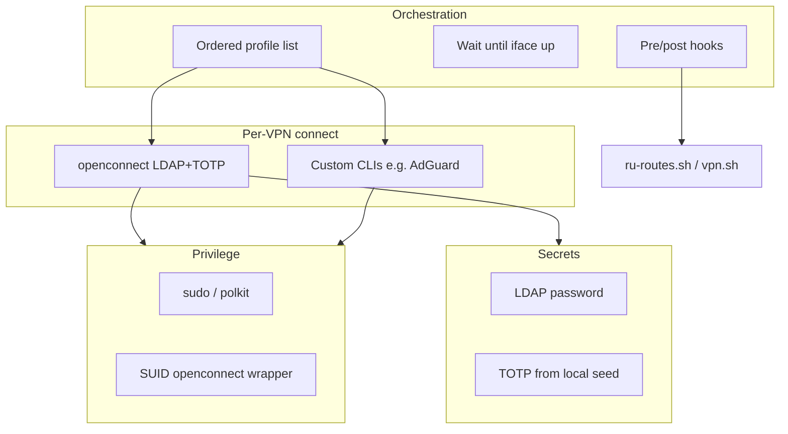
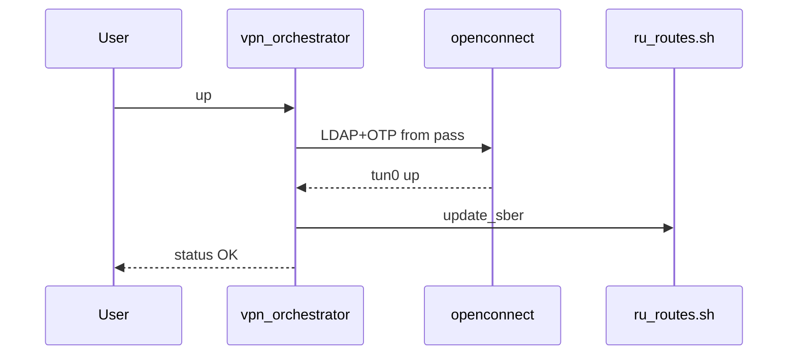

# Multi-VPN connection automation

## Problem decomposition

Three independent concerns:



| Concern | Your case | Existing repo touchpoint |
|--------|-----------|---------------------------|
| **Order** | VPN A before B; routing after tunnel | [`vpn.sh`](../../vpn.sh) |
| **Root** | openconnect needs tun setup | SUID or NOPASSWD sudo for one binary |
| **Auth** | LDAP password + rotating TOTP | Not in repo yet |
| **Routing** | Split tunnel / Sber tables after tun | [`ru-routes.sh`](../../ru-routes.sh) `update_sber`, [`vpn.sh`](../../vpn.sh) |

**Fully unattended** is practical if LDAP password and TOTP seed live in `pass`. Do not use [2fa.live](https://2fa.live/) in automation (sends seed to a third party).

**Secrets how-to:** full step-by-step in [`docs/secrets-setup.md`](../secrets-setup.md).

---

## TOTP capture — `ga_qr_decode.py` (planned)

Google Authenticator **Export** uses `otpauth-migration://offline?data=...` (protobuf). Tool will:

1. Decode PNG/JPEG (`pyzbar` + `libzbar0`) or `--uri`
2. Emit base32 secret, label, issuer, algorithm
3. Feed into `pass otp insert` (see secrets-setup.md)

```bash
./ga_qr_decode.py ~/Downloads/ga-export.png
pass otp insert vpn/sber-totp
```

Multiple export QRs if many accounts. Single-site enrollment uses `otpauth://totp/...?secret=...` — same tool.

---

## openconnect mechanics

1. TLS → username + LDAP password  
2. Second form → 6-digit TOTP  

| Input | Pattern |
|-------|---------|
| LDAP password | `--passwd-on-stdin` |
| OTP | second auth hook, pexpect, or pipe |
| Root | `sudo -n` + NOPASSWD for `/usr/sbin/openconnect` (preferred over broad SUID) |

---

## Profile model (all options)

```yaml
profiles:
  - name: sber_vpn
    connector: openconnect
    server: vpn.example.com
    user: USER
    secrets:
      password: pass:vpn/sber-ldap
      totp: pass:vpn/sber-totp
    wait_iface: tun0
    post_connect:
      - ./ru-routes.sh update_sber

  - name: adguard
    connector: shell
    up: adguardvpn-cli connect
    down: adguardvpn-cli disconnect
    wait_iface: tun1
    post_connect: []
```

---

## Architecture options

### Option 1 — Shell script (`vpn.sh`)

- Profiles YAML + `pass` + `oathtool`
- Matches [`ru-routes.sh`](../../ru-routes.sh) style  
- **Best for:** 2–4 VPNs, stable openconnect forms

### Option 2 — Python `vpnctl` + connector plugins

- `pyotp`, optional `pexpect`; same YAML  
- **Best for:** several custom CLIs, evolving auth

### Option 3 — systemd units

- Ordered services, `EnvironmentFile` for secrets  
- **Best for:** login-time always-on VPN  
- **Hybrid:** generate units from YAML later

### Option 4 — Semi-attended fallback

- Per-profile: `unattended` | `session` (prompt LDAP once) | `manual` (OTP by hand)

**Suggested path:** Option 1 or 2 → complete [`secrets-setup.md`](../secrets-setup.md) → sudoers for openconnect → optional systemd later.

---

## Privilege model

| Method | Risk |
|--------|------|
| NOPASSWD for `/usr/sbin/openconnect` only | Low |
| SUID wrapper with argv allowlist | Medium |
| Full NOPASSWD sudo | High — avoid |

---

## Integration with ip_routes



- After Sber: [`ru-routes.sh update_sber`](../../ru-routes.sh)  
- After AdGuard: handled by shell connector in [`vpn.sh`](../../vpn.sh)  
- Verify: [`collect.sh`](../../collect.sh), [`test-sites`](../../test-sites)

---

## Open decisions (before implementation)

1. Custom connector list (commands, tun names)  
2. Sample openconnect auth sequence (prompt count / field names)  
3. Architecture choice: 1, 2, 3, or 1+4  
4. Store LDAP in pass? (if no → session mode for LDAP)

---

## Implementation order

1. ~~`docs/secrets-setup.md`~~ (done) — link from main README when VPN tool exists  
2. `ga_qr_decode.py` + deps note in README  
3. User completes pass setup per secrets-setup.md  
4. `vpn-profiles.yaml` + orchestrator (option 1 or 2)  
5. sudoers/SUID doc snippet  
6. `test-sites` after first full connect
